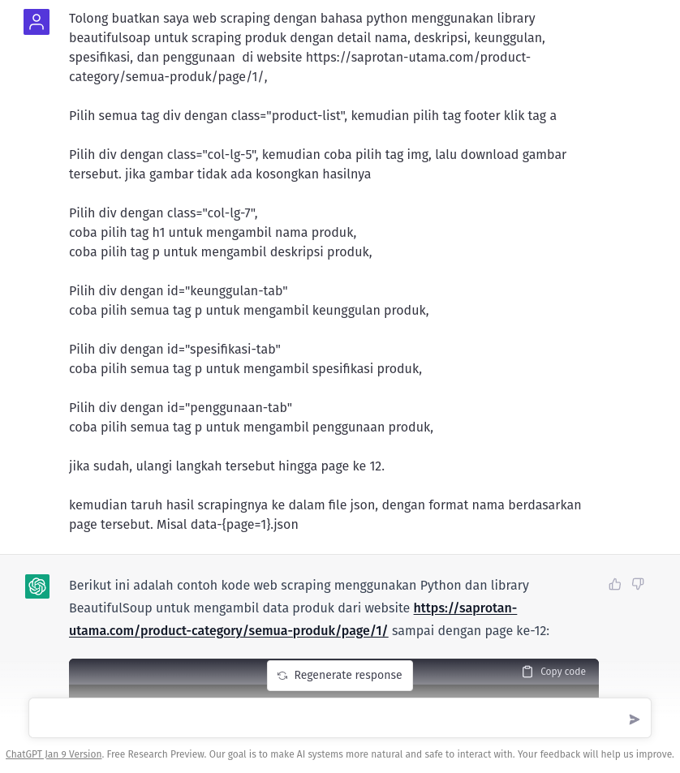

## Build a Web Scraper using ChatGPT and Python

### instruction


### Requirement
- Python ^3.9

### Installation 
- clone project
- create virtual env with following command (ubuntu or popos)
  ```bash
  $ python3 -m venv venv
  ```
- activate the virtual env with :
  ```bash
  $ . venv/bin/activate
  ```
- install depedencies
  ```bash
  $ pip install -U pip && pip install -r requirements.txt
  ```

### Running
```bash
python app.py
```
